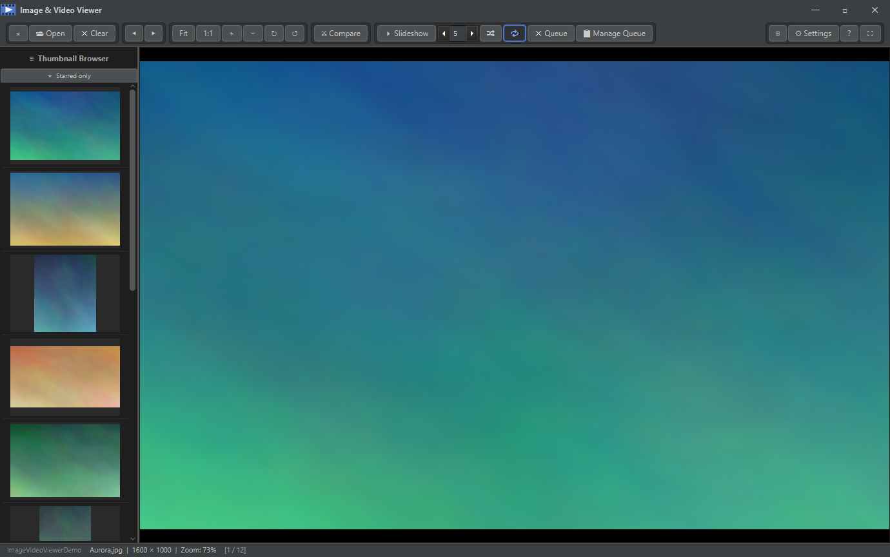

# Image & Video Viewer — JavaFX

A Java/JavaFX port of the Image & Video Viewer, matching the full feature-set of the Python/PySide6 original.

<p align="center"></p>

## Download

**[⬇ Download the latest release](https://github.com/JP-Discoveries/Image-Video-Viewer/releases/latest)** (Windows 64-bit)

Grab the `win-x64` zip, extract it anywhere, and run **`Image Video Viewer.exe`** —
no installation, and no separate Java or Python needed. The portable build bundles
the JRE + JavaFX, VLC, ffmpeg, ImageMagick (RAW/HEIC), and a self-contained Python
runtime for Whisper caption generation and Argos subtitle translation.

To build from source instead, see [Building a Distribution](#building-a-distribution).

## Requirements

| Tool | Version |
|------|---------|
| JDK  | 17 or later (21 recommended) — [Adoptium](https://adoptium.net/) |
| Maven | 3.9+ — [maven.apache.org](https://maven.apache.org/download.cgi) |
| VLC  | 3.x 64-bit — [videolan.org](https://www.videolan.org/) (for broad video format support) |

JavaFX and all other Java dependencies are downloaded automatically from Maven Central on first run.

---

## Quick Start

```bat
Run.bat
```

Or manually:

```bash
mvn javafx:run
```

---

## Project Structure

```
JavaFX/
├── pom.xml                         Maven build (JavaFX 21, VLCJ 4, Jackson 2.17)
├── Run.bat                         Launch shortcut
├── Build.bat                       Build fat-JAR
└── src/main/
    ├── java/com/imageviewer/
    │   ├── module-info.java        JPMS module descriptor
    │   ├── App.java                JavaFX Application entry point
    │   ├── MainWindow.java         Main stage / layout / keyboard / DnD
    │   ├── MediaPane.java          Image zoom+pan & video player (VLCJ + JavaFX)
    │   ├── ThumbnailPanel.java     Virtual thumbnail sidebar (async loading)
    │   ├── ThumbnailBrowserDialog.java  Grid-based full thumbnail browser
    │   ├── FolderBrowserDialog.java     Folder picker + Quick Access (favorites/recent)
    │   ├── ThemeManager.java       CSS theme switching (7 themes)
    │   ├── AppConfig.java          JSON config (~/.image_viewer/config_java.json)
    │   ├── MediaFile.java          Model (path + type + cached thumbnail)
    │   └── TranslationService.java Argos Translate bridge for subtitle translation
    └── resources/com/imageviewer/css/
        ├── dark.css
        ├── light.css
        ├── blue.css
        ├── nord.css
        ├── dracula.css
        ├── monokai.css
        └── highcontrast.css
```

---

## Features

### Image Viewing
- **Formats:** JPG, PNG, BMP, TIFF, ICO, WebP, animated GIF
- **RAW camera files:** CR2/CR3, NEF/NRW, ARW/SRF/SR2, DNG, RAF, ORF, RW2, PEF, RWL, X3F — decoded via ImageMagick
- **HEIC/HEIF:** Apple photo format via ImageMagick (requires libheif support in your ImageMagick build)
- Scroll-wheel zoom (5% – 3200%), centred on cursor
- Middle-button or right-button drag to **pan**
- **Fit**, **Fill**, **Actual size (1:1)** modes
- **Rotate** 90° left and right
- **Alpha transparency**: PNG/WebP alpha renders over a checkerboard background
- **Image prefetching**: next image loaded in background for instant navigation

### Video Playback
- **VLCJ (VLC)**: MP4, MKV, AVI, MOV, WebM, WMV, FLV, TS/MTS/M2TS, HEVC/H.265, VP9, and all other formats VLC supports
- **JavaFX MediaPlayer** fallback when VLC is not available
- **Alpha video**: VP9-alpha WebM and ProRes 4444/Animation .mov rendered with FFmpeg BGRA pipe over checkerboard
- **Seek bar** with click-to-seek and drag
- **Play / Pause**, skip ±10 s, restart (⏮)
- **Volume slider** + **Mute** toggle
- **Loop mode** toggle (🔁)
- Auto-hiding control overlay (fades after inactivity)
- Click video to play/pause
- **Seek-to-timestamp** dialog for precise navigation
- **Audio badge**: colored dot on video thumbnails (green = has audio)

### Subtitles & Translation
- Loads `.srt` and `.vtt` files from the same directory or a `subtitles/` subfolder
- **Whisper CC generation**: transcribe audio to subtitles via local Whisper CLI
- **Subtitle translation**: translate CC to any language via Argos Translate (requires `pip install argostranslate`)

### Navigation
| Key | Action |
|-----|--------|
| ← / → | Prev / Next file |
| Page Up / Down | Prev / Next file |
| Home / End | First / Last file |
| Space | Play / Pause video |
| + / − | Zoom in / out |
| 0 | Zoom to fit |
| R | Rotate right 90° |
| L | Rotate left 90° |
| F / F11 | Toggle full-screen |
| T | Cycle theme |
| C | Toggle compare mode |
| O / Ctrl+O | Open folder |
| Ctrl+S | Slideshow toggle |
| Escape | Exit full-screen |
| ? | Keyboard shortcuts help |

### Compare Mode (⚔)
- Side-by-side SplitPane with independent panes
- **Alt+click** a thumbnail to load into the compare pane
- **Alt+← / →** navigates the compare pane independently

### Slideshow
- **Ctrl+click** thumbnails to add to queue (orange numbered badge)
- Plays queued files (or all files if queue is empty)
- Configurable interval (seconds) via spinner
- Progress bar shows time until next slide
- **Video-aware**: waits for video to finish before advancing

### Folder Browsing
- Open folder via toolbar or **Ctrl+O** / **O**
- **Drag & drop** folders or individual files onto the window
- Recursive scan (skips `thumbnails/`, `subtitles/`, `.cache` subdirectories)
- **Thumbnail Browser** (grid dialog): browse all files in a 4-column virtualized grid with filter and sort
- **File system watcher**: auto-rescans folder when files are added or removed
- Restores the last opened folder on startup

### Quick Access
- **Favorites** (⭐): star folders for one-click access
- **Recent folders** (🕐): automatically tracked
- Accessible from the left panel in the Folder Browser dialog

### Themes
13 built-in CSS themes. Press **T** or click 🎨 to cycle, or pick from the Settings dialog (⚙):

| Theme | Description |
|-------|-------------|
| Dark | Charcoal background, blue accent (default) |
| Light | White background, dark text |
| Blue | Navy background, blue tones |
| Nord | Arctic blue-gray palette |
| Dracula | Purple/pink on dark background |
| Monokai | Warm dark, vivid green accent |
| High Contrast | Pure black, bold yellow/cyan accents |
| Solarized Dark | Warm muted teal — easy on the eyes |
| Solarized Light | Warm cream background, same palette |
| Gruvbox | Retro earthy orange on dark brown |
| One Dark | Blue-gray (Atom/VSCode style) |
| Catppuccin | Soft lavender pastels on dark |
| Tokyo Night | Deep midnight blue-purple |

### Image Transitions
Configurable transition between images (Settings ⚙):
- **None** (instant)
- **Fade** (cross-fade)
- **Dip to Black** (fade out, fade in)

### Config Persistence
Settings saved to `~/.image_viewer/config_java.json`:
- Window size & position
- Last opened folder + recent folders
- Favourite folders
- Theme, volume, slideshow interval
- Transition mode, sidebar collapsed state

---

## Optional Dependencies

| Dependency | Purpose | Install |
|-----------|---------|---------|
| VLC 3.x (64-bit) | Broad video format support | [videolan.org](https://www.videolan.org/) |
| ImageMagick | RAW camera file decoding + HEIC/HEIF | [imagemagick.org](https://imagemagick.org/) (Windows build with libheif for HEIC) |
| Whisper CLI | Automatic subtitle generation | `pip install openai-whisper` |
| argostranslate | Subtitle translation | `pip install argostranslate` |

All optional — the viewer works without them (with reduced format support).

---

## Building a Distribution

```bash
# Fat JAR (still requires JRE with JavaFX on module-path)
mvn package
# Output: target/image-video-viewer-1.0.0-fat.jar
```

### Self-contained Windows app-image (jpackage)

The portable build bundles a JRE, JavaFX, VLC, ffmpeg, ImageMagick, and a
fully self-contained Python runtime (faster-whisper + Argos Translate + a
pre-downloaded Whisper model). Run these from the project root on Windows:

```powershell
mvn package                  # build the fat JAR + stage JavaFX modules
./stage_and_package.ps1      # bundle VLC/ffmpeg/ImageMagick, run jpackage
./build_portable_python.ps1  # add the embeddable Python + Whisper/Argos + model
./repackage_only.ps1         # re-run jpackage to fold Python into the app-image
# Output: target/Image Video Viewer/  (run "Image Video Viewer.exe")
```

`build_portable_python.ps1` uses the python.org **embeddable** distribution, so
the bundled Python is relocatable and works on machines with no Python installed.
The native tools (VLC, ffmpeg, ImageMagick) are bundled from this build machine,
so install them first to include them.

---

## License

Licensed under the **GNU General Public License v3.0** — see [LICENSE](LICENSE).

GPLv3 is used because the app links against and redistributes
[VLCJ](https://github.com/caprica/vlcj), which is GPLv3-licensed.
